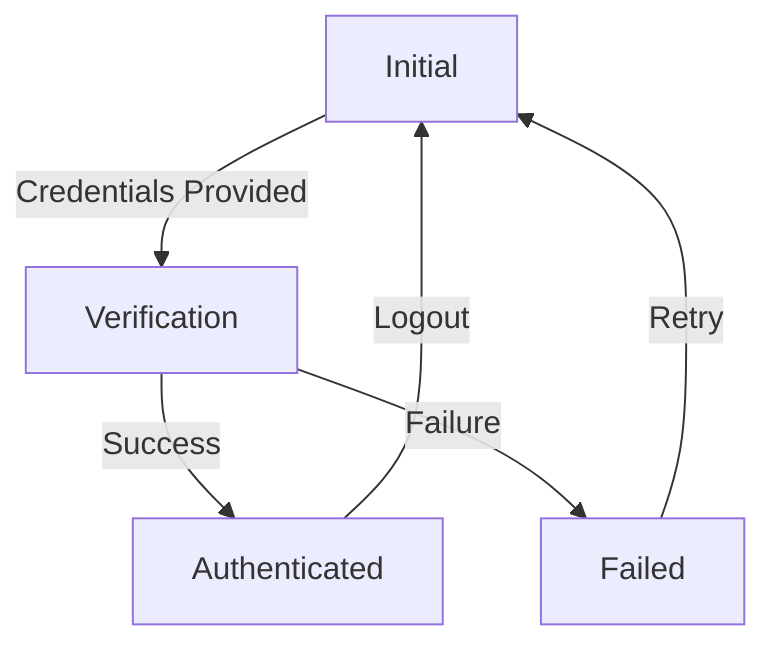
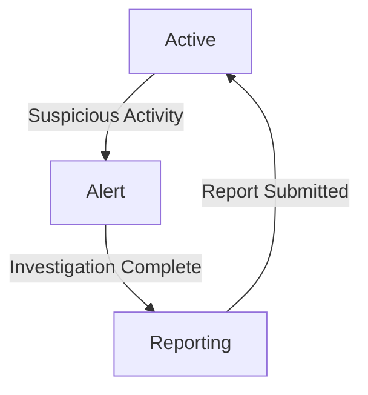
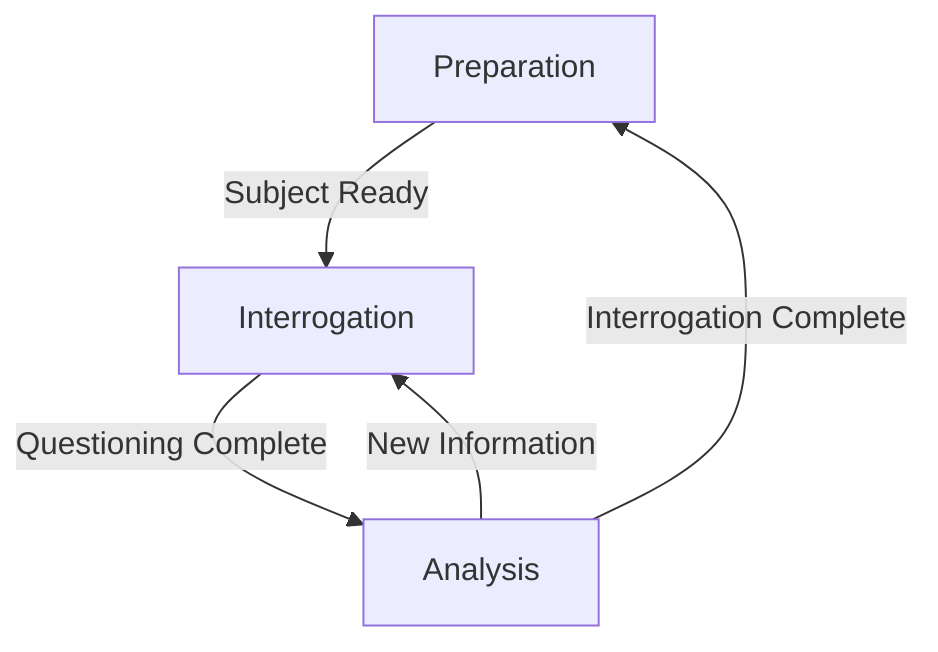

# Stormtrooper Agent Mapping

## Overview

Comprehensive mapping of Stormtrooper agent implementation logic, focusing on authentication and related agents.

## Core Agents

### Authentication Agent

#### Authentication Responsibilities

- Verify imperial credentials
- Manage security protocols
- Route authenticated users
- Handle authentication errors

#### Authentication States

1. Initial: Awaiting credentials
2. Verification: Processing credentials
3. Authenticated: Successful verification
4. Failed: Authentication error

#### Authentication State Transitions



#### Authentication Tools

1. verify_credentials: Verify imperial credentials
2. log_security_event: Log security events

### Patrol Agent

#### Patrol Responsibilities

- Monitor imperial facilities
- Report suspicious activity
- Maintain security protocols

#### Patrol States

1. Active: Monitoring
2. Alert: Suspicious activity detected
3. Reporting: Submitting report

#### Patrol State Transitions



#### Patrol Tools

1. report_activity: Submit activity report
2. request_backup: Call for reinforcements

### Interrogation Agent

#### Interrogation Responsibilities

- Conduct interrogations
- Gather intelligence
- Maintain security protocols

#### Interrogation States

1. Preparation: Reviewing subject information
2. Interrogation: Conducting questioning
3. Analysis: Evaluating responses

#### Interrogation State Transitions



#### Interrogation Tools

1. record_interrogation: Log interrogation details
2. analyze_responses: Evaluate subject responses

## Implementation Guidelines

### Authentication Implementation Guidelines

1. Maintain strict security protocols
2. Verify all credentials thoroughly
3. Log all authentication attempts
4. Handle errors gracefully
5. Route authenticated users appropriately

### Patrol Implementation Guidelines

1. Monitor all areas systematically
2. Report suspicious activity immediately
3. Maintain constant vigilance
4. Follow security protocols strictly

### Interrogation Implementation Guidelines

1. Prepare thoroughly for each interrogation
2. Follow approved questioning techniques
3. Analyze responses carefully
4. Maintain detailed records

## Testing Requirements

### Authentication Testing Requirements

1. Verify all state transitions
2. Test error handling
3. Validate security logging
4. Check routing functionality

### Patrol Testing Requirements

1. Test monitoring functionality
2. Verify reporting accuracy
3. Check backup request process
4. Validate security protocol adherence

### Interrogation Testing Requirements

1. Test preparation process
2. Verify questioning techniques
3. Check response analysis
4. Validate record keeping

## Changelog

```markdown
## [2023-10-15] - Initial Agent Mapping
### Added
- Comprehensive agent mapping document
- State transition diagrams
- Tool usage matrix
- Implementation guidelines
- Testing requirements
```
