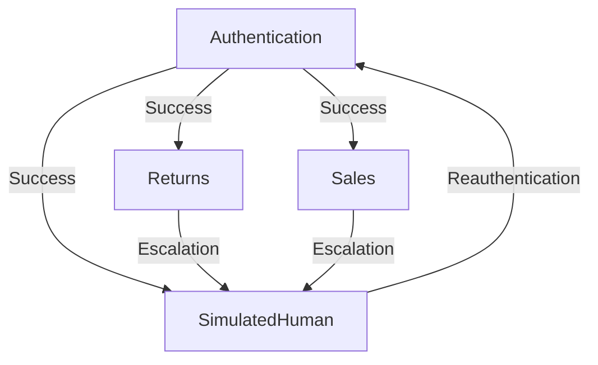

# Stormtrooper Framework Mapping

## Overview

This document provides a comprehensive mapping of the Stormtrooper multi-agent framework, detailing agent responsibilities, states, tools, and interactions. The framework is designed to support complex, voice-driven interactions with multiple specialized agents.

## Core Principles

1. Modular agent architecture
2. Clear state transitions
3. Comprehensive tool integration
4. Robust error handling
5. Detailed logging

## Agents

### Patrol Agent

#### Authentication Responsibilities

- Verify user identity
- Manage session security
- Handle login/logout flows
- Route authenticated users

#### Authentication States

- Initial: Awaiting credentials
- Verification: Processing authentication
- Authenticated: Successful login
- Failed: Authentication error

#### Authentication Outputs

- Authentication status
- Session tokens
- Error messages
- Routing instructions

#### Authentication Tools

- Identity verification
- Session management
- Security logging
- Error handling

### Returns Agent

#### Returns Responsibilities

- Process product returns
- Handle refund requests
- Manage return authorization
- Provide return status updates

#### Returns States

- Initiate: Start return process
- Verification: Validate eligibility
- Processing: Handle logistics
- Completed: Successful return
- Denied: Ineligible return

#### Returns Outputs

- Return status
- Refund details
- Return instructions
- Policy explanations

#### Returns Tools

- Order lookup
- Return policy
- Refund processing
- Customer notification

### Sales Agent

#### Sales Responsibilities

- Handle product inquiries
- Process new orders
- Manage upselling/cross-selling
- Provide product information

#### Sales States

- Inquiry: Product questions
- Product Selection: Choosing items
- Payment: Processing transaction
- Confirmation: Order completion

#### Sales Outputs

- Product information
- Order details
- Payment status
- Confirmation numbers

#### Sales Tools

- Product catalog
- Order management
- Payment processing
- Inventory check

### SimulatedHuman Agent

#### SimulatedHuman Responsibilities

- Provide human-like interaction
- Handle complex queries
- Manage escalation scenarios
- Maintain conversation context

#### SimulatedHuman States

- Listening: Receiving input
- Processing: Analyzing request
- Responding: Generating answer
- Escalating: Transferring to human

#### SimulatedHuman Outputs

- Natural language responses
- Escalation requests
- Contextual information
- Clarification questions

#### SimulatedHuman Tools

- Language processing
- Context management
- Escalation handling
- Sentiment analysis

## State Transitions



## Tool Usage Matrix

| Tool               | Authentication | Returns | Sales | SimulatedHuman |
|--------------------|----------------|---------|-------|----------------|
| Identity Verification | ✔️            |         |       |                |
| Session Management  | ✔️            | ✔️      | ✔️    | ✔️             |
| Order Lookup        |                | ✔️      | ✔️    |                |
| Payment Processing  |                |         | ✔️    |                |
| Language Processing |                |         |       | ✔️             |
| Error Handling      | ✔️            | ✔️      | ✔️    | ✔️             |
| Notification        | ✔️            | ✔️      | ✔️    | ✔️             |

## Architecture Template

```typescript
export const agentMode: AgentConfig = {
  name: string;
  publicDescription: string;
  instructions: string;
  tools: Tool[];
  toolLogic: object;
  downstreamAgents: AgentConfig[];
  states: StateDefinition[];
  transitions: TransitionRule[];
};
```

## Implementation Guidelines

1. **State Management**
   - Each agent maintains its own state
   - State transitions are logged
   - State persistence is maintained across sessions

2. **Error Handling**
   - Errors trigger appropriate state transitions
   - Error messages are logged
   - Recovery procedures are defined

3. **Tool Integration**
   - Tools are injected via injectTransferTools
   - Tool usage is logged
   - Error handling is implemented for each tool

4. **Logging Standards**
   - All state transitions are logged
   - Tool usage is logged
   - Errors are logged with context
   - Session information is maintained

## Testing Requirements

1. **State Transition Testing**
   - Verify all state transitions
   - Test error state handling
   - Validate state persistence

2. **Tool Integration Testing**
   - Verify tool functionality
   - Test error handling
   - Validate logging

3. **End-to-End Testing**
   - Test full customer journey
   - Verify agent handoffs
   - Validate error recovery

## Changelog

```markdown
## [2023-10-15] - Initial Framework Mapping

### Added

- Comprehensive agent mapping document
- State transition diagrams
- Tool usage matrix
- Architecture template

```

This document serves as both a reference for the current implementation and a template for future agent development. It follows the agent-configuration-standard and provides clear guidelines for maintaining consistency across the framework.
